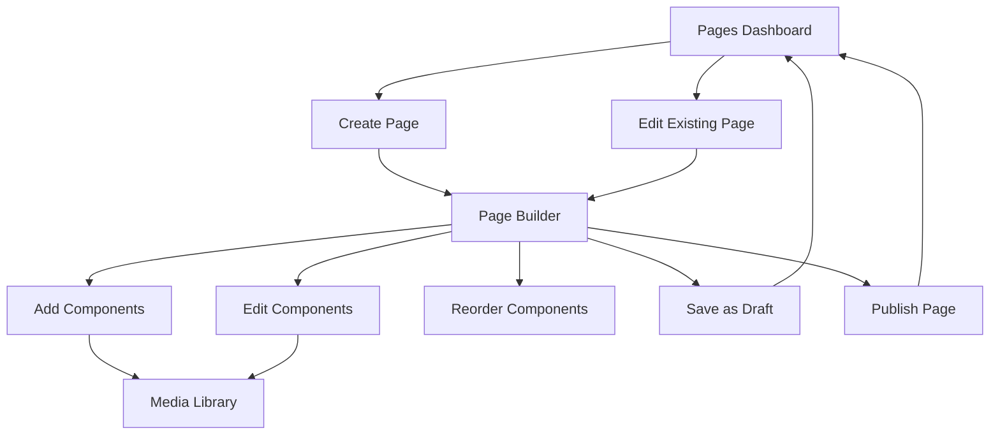

## 1. Product Overview
The CMS Pages Manager is a core component of the driving school content management system that enables non-technical administrators to create, manage, and publish web pages through a visual interface. This system transforms the existing component-based CMS into a user-friendly page builder that eliminates the need for technical knowledge while maintaining professional quality output.

The product solves the problem of website content management for driving school owners who need to update their website regularly without hiring developers, allowing them to build pages visually using predefined components and manage their online presence independently.

## 2. Core Features

### 2.1 User Roles
| Role | Registration Method | Core Permissions |
|------|---------------------|------------------|
| Admin | JWT authentication | Full CMS access: create/edit/delete pages, manage components, upload media, publish content |
| Guest User | No registration | View published pages only |

### 2.2 Feature Module
The CMS Pages Manager consists of the following main pages:
1. **Pages Dashboard**: Overview of all CMS pages with status management
2. **Page Builder**: Visual drag-and-drop interface for building pages with components
3. **Media Library**: Upload and manage images for use in components

### 2.3 Page Details
| Page Name | Module Name | Feature description |
|-----------|-------------|---------------------|
| Pages Dashboard | Page List | Display all CMS pages with columns for title, slug, status (draft/published), and last modified date |
| Pages Dashboard | Create Page | Button to create new page with modal form for slug and title input |
| Pages Dashboard | Status Toggle | Switch between draft and published states for each page |
| Pages Dashboard | Delete Page | Safe deletion with confirmation dialog and dependency checks |
| Pages Dashboard | Quick Actions | Edit button that navigates to Page Builder for selected page |
| Page Builder | Component Palette | Sidebar panel showing available component types (hero, text-block, image-text, services-list, cta, opening-hours, gallery) |
| Page Builder | Canvas Area | Main workspace where components are dropped and arranged |
| Page Builder | Drag & Drop | Reorder components using mouse drag with visual feedback |
| Page Builder | Component Editor | Inline form editing for each component's fields with real-time preview |
| Page Builder | Media Selector | Button to open media library modal for image selection in components |
| Page Builder | Save Actions | Save as draft and publish buttons with status indicators |
| Media Library | Upload Zone | Drag-and-drop or click-to-upload interface for images |
| Media Library | Thumbnail Grid | Visual grid display of uploaded media with thumbnails |
| Media Library | Delete Media | Remove unused media with safety checks for references |
| Media Library | Select Media | Click to select media for component insertion |

## 3. Core Process
**Admin Flow for Page Creation:**
1. Navigate to Pages Dashboard
2. Click "Create New Page" button
3. Enter page title and slug in modal form
4. Click "Build Page" to enter Page Builder
5. Drag components from palette to canvas
6. Configure component fields using inline forms
7. Select images from Media Library when needed
8. Reorder components via drag-and-drop
9. Save as draft for testing
10. Publish when ready for public viewing

**Component Editing Flow:**
1. Click on any component in canvas
2. Field editor appears with appropriate input types
3. Make changes with real-time preview
4. Save component changes
5. Continue editing or save entire page

## 4. User Interface Design

### 4.1 Design Style
- **Primary Colors**: Professional blue (#2563eb) for primary actions, gray (#6b7280) for secondary elements
- **Button Style**: Rounded corners (8px radius), clear hover states, disabled state for unavailable actions
- **Font**: System fonts for readability (Inter or similar sans-serif)
- **Layout Style**: Card-based components with subtle shadows, left sidebar for navigation/tools
- **Icons**: Feather icons or similar minimalist icon set for clarity

### 4.2 Page Design Overview
| Page Name | Module Name | UI Elements |
|-----------|-------------|-------------|
| Pages Dashboard | Page List | Clean table with alternating row colors, status badges (green for published, gray for draft), action buttons with icons |
| Pages Dashboard | Create Modal | Centered modal with form inputs, validation messages, cancel/save buttons |
| Page Builder | Component Palette | Collapsible sidebar with component cards showing preview thumbnails and names |
| Page Builder | Canvas | White background with drop zones, component outlines on hover, drag handles on components |
| Page Builder | Field Editor | Inline forms with appropriate input types (text, textarea, image selector), save/cancel buttons |
| Media Library | Upload Area | Dashed border drop zone with upload icon and instructions |
| Media Library | Grid | Responsive grid layout, hover overlay with delete button, loading states for uploads |

### 4.3 Responsiveness
Desktop-first design with mobile-responsive admin interface. Touch interaction optimized for tablet use. Front-office pages fully responsive for all device sizes.

### 4.4 Component Visual Guidelines
Each component type has consistent spacing (24px padding), professional typography hierarchy, and maintains visual consistency across the driving school website theme.