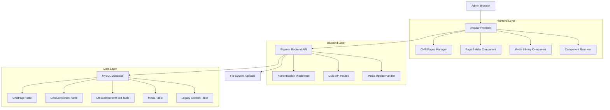
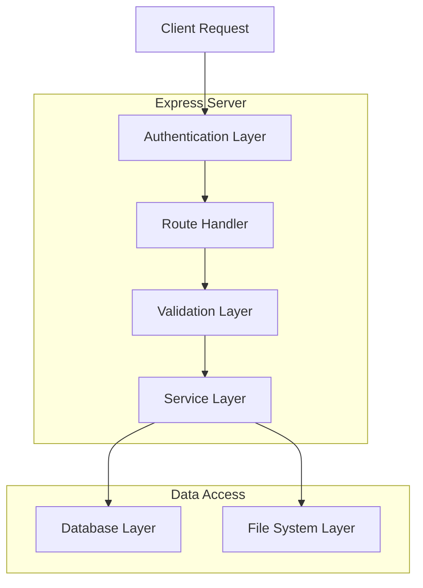
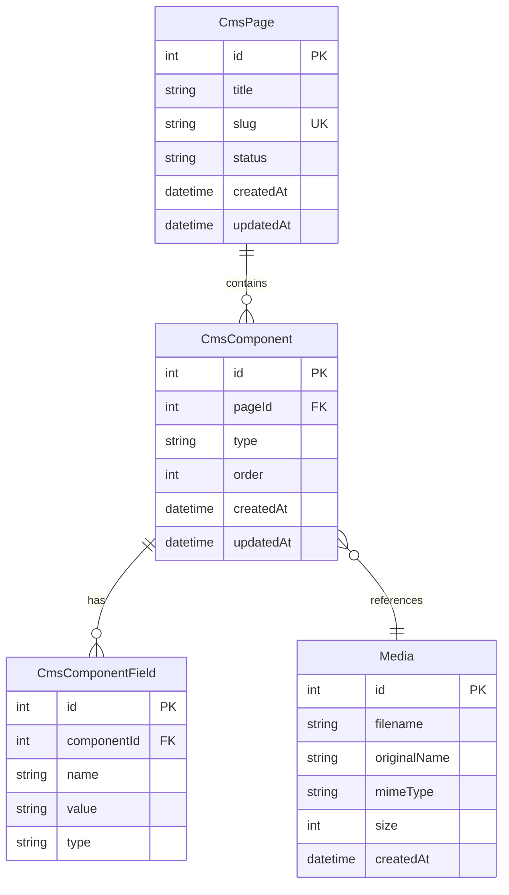

## 1. Architecture Design



## 2. Technology Description

- **Frontend**: Angular 15+ with TypeScript, RxJS for state management
- **Backend**: Express.js 4+ with Node.js, JWT authentication
- **Database**: MySQL 8+ with Sequelize ORM
- **File Storage**: Local filesystem with /uploads directory
- **Initialization Tool**: Angular CLI for frontend setup

## 3. Route Definitions

| Route | Purpose |
|-------|---------|
| /admin/cms/pages | CMS Pages Dashboard - list all pages |
| /admin/cms/pages/new | Create new page form |
| /admin/cms/pages/:id/build | Page Builder interface for editing |
| /admin/cms/media | Media Library management |
| /api/cms/pages | CRUD API for pages |
| /api/cms/components | Component management API |
| /api/cms/media | Media upload and management API |
| /api/cms/pages/:slug | Public API for page content |

## 4. API Definitions

### 4.1 Page Management API

**Create Page**
```
POST /api/cms/pages
```

Request:
| Param Name | Param Type | isRequired | Description |
|------------|-------------|-------------|-------------|
| title | string | true | Page title for display |
| slug | string | true | URL-friendly identifier |
| status | string | false | 'draft' or 'published' (default: 'draft') |

Response:
| Param Name | Param Type | Description |
|------------|-------------|-------------|
| id | number | Unique page identifier |
| title | string | Page title |
| slug | string | URL slug |
| status | string | Current status |
| createdAt | datetime | Creation timestamp |

### 4.2 Component Management API

**Add Component to Page**
```
POST /api/cms/components
```

Request:
| Param Name | Param Type | isRequired | Description |
|------------|-------------|-------------|-------------|
| pageId | number | true | Target page ID |
| type | string | true | Component type (hero, text-block, etc.) |
| order | number | true | Display order position |

**Update Component Fields**
```
PUT /api/cms/components/:id/fields
```

Request:
| Param Name | Param Type | isRequired | Description |
|------------|-------------|-------------|-------------|
| fields | array | true | Array of field objects with name, value, type |

### 4.3 Media Management API

**Upload Media**
```
POST /api/cms/media/upload
```

Request:
| Param Name | Param Type | isRequired | Description |
|------------|-------------|-------------|-------------|
| file | file | true | Image file (jpg, png, gif, webp) |

Response:
| Param Name | Param Type | Description |
|------------|-------------|-------------|
| id | number | Media ID for reference |
| filename | string | Stored filename |
| url | string | Public access URL |
| size | number | File size in bytes |

## 5. Server Architecture Diagram



## 6. Data Model

### 6.1 Database Schema



### 6.2 Data Definition Language

**CmsPage Table**
```sql
CREATE TABLE cms_pages (
    id INT PRIMARY KEY AUTO_INCREMENT,
    title VARCHAR(255) NOT NULL,
    slug VARCHAR(255) UNIQUE NOT NULL,
    status ENUM('draft', 'published') DEFAULT 'draft',
    createdAt TIMESTAMP DEFAULT CURRENT_TIMESTAMP,
    updatedAt TIMESTAMP DEFAULT CURRENT_TIMESTAMP ON UPDATE CURRENT_TIMESTAMP,
    INDEX idx_status (status),
    INDEX idx_slug (slug)
);
```

**CmsComponent Table**
```sql
CREATE TABLE cms_components (
    id INT PRIMARY KEY AUTO_INCREMENT,
    pageId INT NOT NULL,
    type VARCHAR(50) NOT NULL,
    orderIndex INT NOT NULL,
    createdAt TIMESTAMP DEFAULT CURRENT_TIMESTAMP,
    updatedAt TIMESTAMP DEFAULT CURRENT_TIMESTAMP ON UPDATE CURRENT_TIMESTAMP,
    FOREIGN KEY (pageId) REFERENCES cms_pages(id) ON DELETE CASCADE,
    INDEX idx_page_order (pageId, orderIndex)
);
```

**CmsComponentField Table**
```sql
CREATE TABLE cms_component_fields (
    id INT PRIMARY KEY AUTO_INCREMENT,
    componentId INT NOT NULL,
    name VARCHAR(100) NOT NULL,
    value TEXT,
    type VARCHAR(50) DEFAULT 'text',
    createdAt TIMESTAMP DEFAULT CURRENT_TIMESTAMP,
    FOREIGN KEY (componentId) REFERENCES cms_components(id) ON DELETE CASCADE,
    INDEX idx_component_name (componentId, name)
);
```

**Media Table**
```sql
CREATE TABLE media (
    id INT PRIMARY KEY AUTO_INCREMENT,
    filename VARCHAR(255) NOT NULL,
    originalName VARCHAR(255) NOT NULL,
    mimeType VARCHAR(100) NOT NULL,
    size INT NOT NULL,
    createdAt TIMESTAMP DEFAULT CURRENT_TIMESTAMP,
    INDEX idx_created (createdAt DESC)
);
```

## 7. Component Field Types Schema

**Hero Component Fields:**
- title (text)
- subtitle (text)
- backgroundImage (media)
- ctaText (text)
- ctaLink (text)

**Text Block Component Fields:**
- content (textarea)
- alignment (select: left, center, right)

**Image-Text Component Fields:**
- image (media)
- title (text)
- content (textarea)
- imagePosition (select: left, right)

**Services List Component Fields:**
- services (json array of service objects)

**CTA Component Fields:**
- title (text)
- description (textarea)
- buttonText (text)
- buttonLink (text)

**Opening Hours Component Fields:**
- schedule (json object with day/hour pairs)

**Gallery Component Fields:**
- images (json array of media IDs)
- layout (select: grid, carousel)