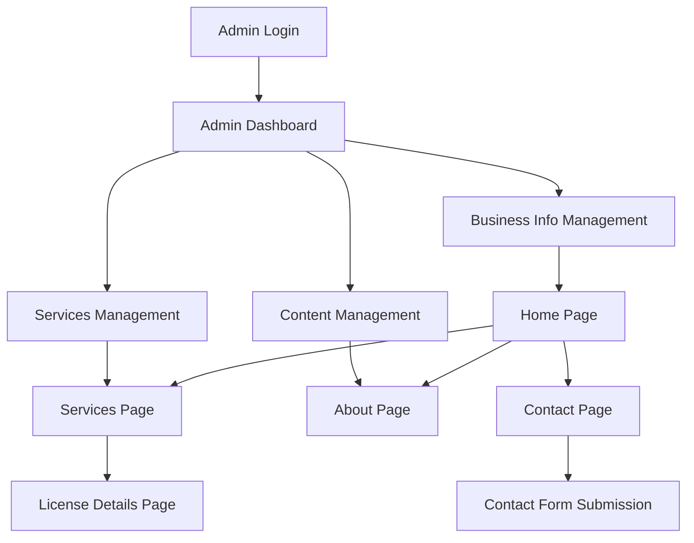

## 1. Product Overview

Auto-École CAR 18 ème is a professional driving school business website that provides comprehensive information about driving license services in Paris. The platform enables dynamic content management through a secure admin dashboard while delivering a modern, responsive user experience for potential students seeking driving education services.

The website solves the problem of static, outdated driving school websites by providing real-time content updates, service management, and professional online presence that attracts and converts potential students.

## 2. Core Features

### 2.1 User Roles

| Role | Registration Method | Core Permissions |
|------|---------------------|------------------|
| Website Visitor | No registration required | Browse all public content, contact school |
| Admin | Secure login with JWT | Full CRUD access to all business data, content management |

### 2.2 Feature Module

The driving school website consists of the following main pages:
1. **Home page**: Hero section, services overview, business information, contact CTAs
2. **Services page**: Complete service catalog with driving license categories
3. **Driving licenses details page**: Detailed information for each license type
4. **About page**: School history, team, facilities, certifications
5. **Contact page**: Contact form, map, business hours, direct contact info
6. **Legal page**: Terms, privacy policy, legal notices
7. **Admin dashboard**: Secure backend for content management

### 2.3 Page Details

| Page Name | Module Name | Feature description |
|-----------|-------------|---------------------|
| Home page | Hero section | Display school name, tagline, primary CTA buttons with smooth animations |
| Home page | Services overview | Dynamic grid of driving license services with icons and brief descriptions |
| Home page | Business info | Display address, phone, email with click-to-call and click-to-email functionality |
| Home page | Contact CTAs | Prominent call-to-action buttons for enrollment and contact |
| Services page | Service categories | Organized display of Permis B, Permis A, and Code accéléré services |
| Services page | Service cards | Individual service cards with descriptions, pricing, and enrollment options |
| Driving licenses details page | License information | Detailed descriptions of requirements, process, duration, and costs |
| Driving licenses details page | Vehicle types | Display available vehicles for each license type with icons |
| About page | School presentation | Company history, mission, values with professional imagery |
| About page | Team section | Instructor profiles with photos and qualifications |
| About page | Facilities | Photo gallery of training vehicles and facilities |
| Contact page | Contact form | Secure form with name, email, phone, message fields and validation |
| Contact page | Business hours | Weekly schedule with current day highlighting |
| Contact page | Map integration | Interactive map showing school location |
| Legal page | Legal notices | Company registration information, SIRET, insurance details |
| Legal page | Privacy policy | GDPR-compliant privacy policy with cookie consent |
| Admin dashboard | Authentication | Secure JWT-based login with session management |
| Admin dashboard | Dashboard overview | Quick stats, recent activities, system status |
| Admin dashboard | Business info management | Edit school name, address, contact information with real-time preview |
| Admin dashboard | Services management | CRUD operations for services, categories, enable/disable functionality |
| Admin dashboard | Content management | Edit page content, text blocks, images with WYSIWYG editor |
| Admin dashboard | Media library | Upload, organize, and manage images and icons |

## 3. Core Process

### Website Visitor Flow
1. User lands on homepage and views hero section with school information
2. User browses services overview and clicks for detailed information
3. User navigates to specific license details to understand requirements
4. User accesses contact page to send inquiry or call directly
5. User can access legal information through footer links

### Admin Flow
1. Admin logs into secure dashboard with JWT authentication
2. Admin views dashboard overview with key metrics
3. Admin updates business information that reflects immediately on frontend
4. Admin manages services, adding new services or modifying existing ones
5. Admin edits page content and uploads new media assets

## 4. User Interface Design

### 4.1 Design Style
- **Primary Color**: Professional blue (#1E40AF) representing trust and reliability
- **Secondary Color**: Clean white (#FFFFFF) with light gray (#F3F4F6) backgrounds
- **Accent Color**: Vibrant orange (#F59E0B) for CTAs and important elements
- **Button Style**: Rounded corners (8px radius) with subtle shadows and hover effects
- **Font**: Modern sans-serif (Inter or similar) with clear hierarchy
- **Typography**: H1 36px, H2 28px, H3 24px, Body 16px, Small 14px
- **Icon Style**: Consistent line icons with 2px stroke width
- **Layout**: Card-based design with proper spacing and visual hierarchy

### 4.2 Page Design Overview

| Page Name | Module Name | UI Elements |
|-----------|-------------|-------------|
| Home page | Hero section | Full-width hero with school photo overlay, prominent headline, dual CTAs with orange and blue variants |
| Home page | Services overview | 3-column responsive grid on desktop, single column on mobile, card hover effects with vehicle icons |
| Home page | Business info | Clean contact bar with phone/email icons, sticky header with navigation |
| Services page | Service categories | Accordion-style sections for each license category with expand/collapse functionality |
| Services page | Service cards | Consistent card height, service icons, pricing badges, enrollment buttons |
| Contact page | Contact form | Clean form fields with validation states, success/error messages, submit button with loading state |
| Admin dashboard | Dashboard overview | Clean admin layout with sidebar navigation, data tables, action buttons |
| Admin dashboard | Forms | Professional form layouts with proper field validation, save/cancel actions |

### 4.3 Responsiveness
- Desktop-first design approach with mobile optimization
- Breakpoints: Desktop (1200px+), Tablet (768px-1199px), Mobile (320px-767px)
- Touch-friendly interface with appropriate tap targets (minimum 44px)
- Optimized navigation with hamburger menu on mobile devices
- Responsive images with proper lazy loading

### 4.4 Performance Requirements
- Page load time under 3 seconds on 3G connection
- Smooth 60fps animations and transitions
- Optimized images with WebP format support
- Minimal JavaScript bundle size with tree shaking
- Progressive Web App capabilities with offline support