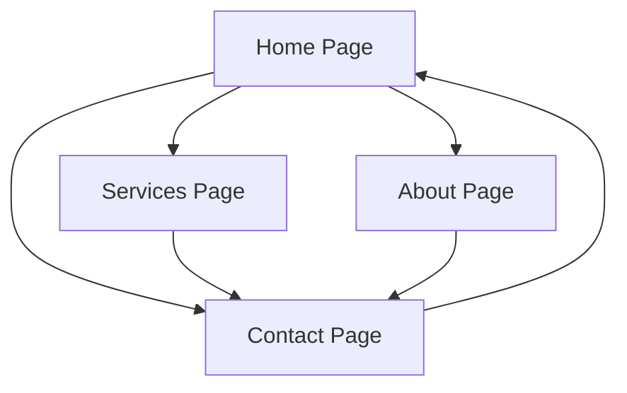

## 1. Product Overview
Professional driving school website frontend for Auto-École CAR 18ème in Paris. Modern, premium UI focused on building trust and driving conversions for potential students seeking driving licenses and training.

Target: Paris residents aged 16-35 seeking driving education, with emphasis on professional presentation and clear service offerings.

## 2. Core Features

### 2.1 User Roles
No user authentication required - this is a public-facing informational website.

### 2.2 Feature Module
The driving school website consists of the following main pages:
1. **Home page**: Hero section, value proposition, services overview, testimonials, call-to-action
2. **Services page**: Detailed service cards for all permit types and training options
3. **About page**: School story, timeline, trust-building content
4. **Contact page**: Contact information, location map, contact form

### 2.3 Page Details
| Page Name | Module Name | Feature description |
|-----------|-------------|---------------------|
| Home page | Hero section | Display strong headline, value proposition, call-to-action buttons with background visual |
| Home page | Why choose us | Showcase competitive advantages with icons and brief descriptions |
| Home page | Our permits | Card-based display of available license types with visual hierarchy |
| Home page | Learning process | Step-by-step visual guide of the learning journey |
| Home page | Testimonials | Modern card layout displaying student reviews and ratings |
| Home page | Call to action | Prominent contact and enrollment buttons |
| Services page | Service cards | Grid layout displaying all permit types (B, A, Code accéléré) with descriptions |
| Services page | Vehicle showcase | Visual display of available training vehicles |
| About page | School story | Professional narrative about the driving school's history and values |
| About page | Timeline | Visual timeline of school milestones and achievements |
| Contact page | Contact information | Display address, phone, email with professional formatting |
| Contact page | Map placeholder | Interactive map showing school location |
| Contact page | Contact form | Clean form UI for inquiries (frontend only) |

## 3. Core Process
User navigation flow for potential students discovering the driving school:

## 4. User Interface Design

### 4.1 Design Style
- **Primary colors**: Deep blue (#1e40af) for trust, white for cleanliness
- **Accent color**: Vibrant orange (#f97316) for CTAs and highlights
- **Typography**: Modern sans-serif (Inter or similar), clean hierarchy
- **Button style**: Rounded corners, subtle shadows, hover animations
- **Card design**: Soft shadows, rounded corners, consistent spacing
- **Icons**: Consistent line-icon style, automotive-inspired where appropriate
- **Layout**: Card-based with generous whitespace, mobile-first approach

### 4.2 Page Design Overview
| Page Name | Module Name | UI Elements |
|-----------|-------------|-------------|
| Home page | Hero section | Full-width hero with overlay text, prominent CTA buttons, high-quality background image |
| Home page | Why choose us | 3-column grid on desktop, stacked on mobile, icon + title + short text |
| Home page | Our permits | Card grid with permit type, brief description, visual indicators |
| Home page | Learning process | Horizontal stepper on desktop, vertical on mobile, numbered steps |
| Home page | Testimonials | Carousel or grid of review cards with student photos and ratings |
| Services page | Service cards | Responsive grid layout, hover effects, consistent card heights |
| About page | School story | Balanced text and image layout, professional photography |
| About page | Timeline | Vertical timeline with milestones, clean line design |
| Contact page | Contact information | Clean card layout with icon + information pairs |
| Contact page | Contact form | Modern form fields with proper validation styling, submit button |

### 4.3 Responsiveness
- **Mobile-first design approach**
- **Breakpoints**: 640px (mobile), 768px (tablet), 1024px (desktop)
- **Touch-optimized interactions**
- **Smooth transitions between breakpoints**
- **Sticky header with mobile hamburger menu**

### 4.4 Visual Identity Requirements
- **Automotive inspiration**: Subtle design elements suggesting movement and vehicles
- **Professional photography**: Real vehicles, happy students, modern facilities
- **Consistent iconography**: Line icons throughout, automotive-themed where relevant
- **Premium feel**: High contrast, excellent typography, generous spacing