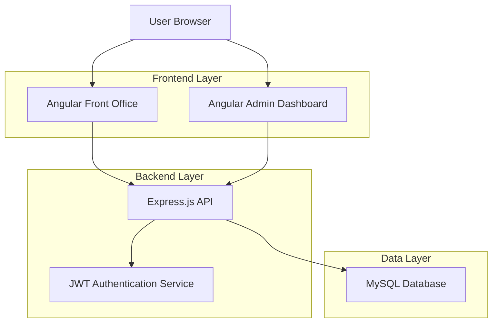
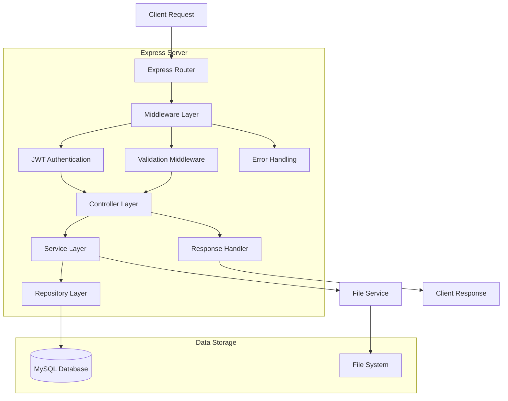
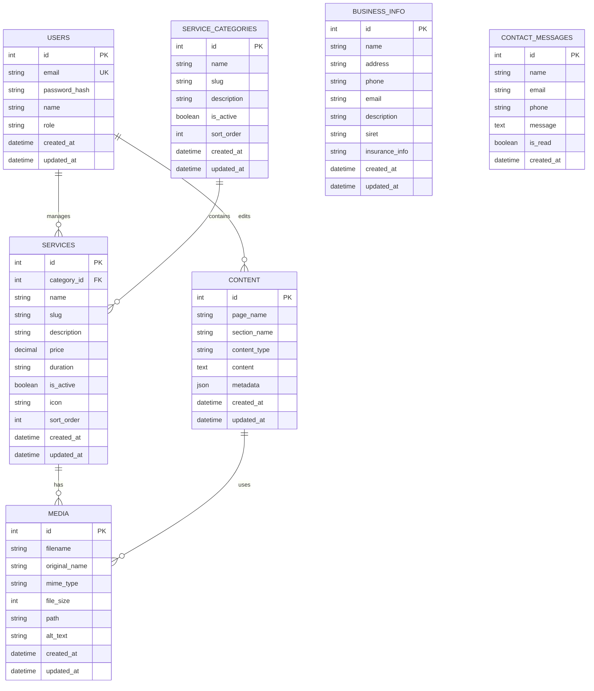

## 1. Architecture Design



## 2. Technology Description

- **Frontend**: Angular@17 + TypeScript + RxJS + Angular Material
- **Admin Dashboard**: Angular@17 + Angular Material + Chart.js
- **Backend**: Express.js@4 + TypeScript + JWT authentication
- **Database**: MySQL@8 + Sequelize ORM
- **File Storage**: Local file system with multer middleware
- **Environment**: Node.js@20 with PM2 process manager

## 3. Route Definitions

### Front Office Routes
| Route | Purpose |
|-------|---------|
| / | Home page with hero section and services overview |
| /services | Services catalog with license categories |
| /services/:id | Detailed service information page |
| /about | About the driving school |
| /contact | Contact form and business information |
| /legal | Legal notices and privacy policy |

### Admin Dashboard Routes
| Route | Purpose |
|-------|---------|
| /admin/login | Admin authentication page |
| /admin/dashboard | Overview dashboard with statistics |
| /admin/business-info | Business information management |
| /admin/services | Service management interface |
| /admin/services/categories | Service category management |
| /admin/content | Page content management |
| /admin/media | Media library management |

### API Routes
| Route | Purpose |
|-------|---------|
| /api/auth/login | Admin authentication endpoint |
| /api/auth/verify | Token verification endpoint |
| /api/business-info | Business information CRUD operations |
| /api/services | Services CRUD operations |
| /api/services/categories | Service categories CRUD operations |
| /api/content | Page content management |
| /api/media | File upload and management |
| /api/contact | Contact form submission |

## 4. API Definitions

### 4.1 Authentication API

**Login**
```
POST /api/auth/login
```

Request:
| Param Name | Param Type | isRequired | Description |
|------------|------------|-------------|-------------|
| email | string | true | Admin email address |
| password | string | true | Admin password |

Response:
| Param Name | Param Type | Description |
|------------|------------|-------------|
| token | string | JWT authentication token |
| user | object | Admin user information |

Example:
```json
{
  "email": "admin@autoecole18.fr",
  "password": "securePassword123"
}
```

### 4.2 Business Info API

**Get Business Information**
```
GET /api/business-info
```

Response:
| Param Name | Param Type | Description |
|------------|------------|-------------|
| name | string | Business name |
| address | string | Complete address |
| phone | string | Contact phone |
| email | string | Contact email |
| description | string | Business description |

**Update Business Information**
```
PUT /api/business-info
```

Request:
| Param Name | Param Type | isRequired | Description |
|------------|------------|-------------|-------------|
| name | string | false | Business name |
| address | string | false | Complete address |
| phone | string | false | Contact phone |
| email | string | false | Contact email |
| description | string | false | Business description |

### 4.3 Services API

**Get All Services**
```
GET /api/services
```

Response:
| Param Name | Param Type | Description |
|------------|------------|-------------|
| services | array | Array of service objects |

Service Object:
| Param Name | Param Type | Description |
|------------|------------|-------------|
| id | number | Service ID |
| name | string | Service name |
| category | string | Service category |
| description | string | Service description |
| price | number | Service price |
| duration | string | Service duration |
| isActive | boolean | Service status |
| icon | string | Service icon URL |

**Create Service**
```
POST /api/services
```

Request:
| Param Name | Param Type | isRequired | Description |
|------------|------------|-------------|-------------|
| name | string | true | Service name |
| categoryId | number | true | Category ID |
| description | string | true | Service description |
| price | number | false | Service price |
| duration | string | false | Service duration |
| icon | string | false | Service icon |

### 4.4 Contact API

**Submit Contact Form**
```
POST /api/contact
```

Request:
| Param Name | Param Type | isRequired | Description |
|------------|------------|-------------|-------------|
| name | string | true | Contact name |
| email | string | true | Contact email |
| phone | string | false | Contact phone |
| message | string | true | Contact message |

## 5. Server Architecture Diagram



## 6. Data Model

### 6.1 Database Schema



### 6.2 Data Definition Language

**Users Table**
```sql
CREATE TABLE users (
  id INT PRIMARY KEY AUTO_INCREMENT,
  email VARCHAR(255) UNIQUE NOT NULL,
  password_hash VARCHAR(255) NOT NULL,
  name VARCHAR(100) NOT NULL,
  role VARCHAR(20) DEFAULT 'admin' CHECK (role IN ('admin')),
  created_at TIMESTAMP DEFAULT CURRENT_TIMESTAMP,
  updated_at TIMESTAMP DEFAULT CURRENT_TIMESTAMP ON UPDATE CURRENT_TIMESTAMP
);

CREATE INDEX idx_users_email ON users(email);
```

**Service Categories Table**
```sql
CREATE TABLE service_categories (
  id INT PRIMARY KEY AUTO_INCREMENT,
  name VARCHAR(100) NOT NULL,
  slug VARCHAR(100) UNIQUE NOT NULL,
  description TEXT,
  is_active BOOLEAN DEFAULT true,
  sort_order INT DEFAULT 0,
  created_at TIMESTAMP DEFAULT CURRENT_TIMESTAMP,
  updated_at TIMESTAMP DEFAULT CURRENT_TIMESTAMP ON UPDATE CURRENT_TIMESTAMP
);

CREATE INDEX idx_categories_slug ON service_categories(slug);
CREATE INDEX idx_categories_active ON service_categories(is_active);
```

**Services Table**
```sql
CREATE TABLE services (
  id INT PRIMARY KEY AUTO_INCREMENT,
  category_id INT NOT NULL,
  name VARCHAR(200) NOT NULL,
  slug VARCHAR(200) UNIQUE NOT NULL,
  description TEXT NOT NULL,
  price DECIMAL(10,2),
  duration VARCHAR(50),
  is_active BOOLEAN DEFAULT true,
  icon VARCHAR(255),
  sort_order INT DEFAULT 0,
  created_at TIMESTAMP DEFAULT CURRENT_TIMESTAMP,
  updated_at TIMESTAMP DEFAULT CURRENT_TIMESTAMP ON UPDATE CURRENT_TIMESTAMP,
  FOREIGN KEY (category_id) REFERENCES service_categories(id) ON DELETE CASCADE
);

CREATE INDEX idx_services_category ON services(category_id);
CREATE INDEX idx_services_active ON services(is_active);
CREATE INDEX idx_services_slug ON services(slug);
```

**Business Info Table**
```sql
CREATE TABLE business_info (
  id INT PRIMARY KEY AUTO_INCREMENT,
  name VARCHAR(200) NOT NULL,
  address TEXT NOT NULL,
  phone VARCHAR(20) NOT NULL,
  email VARCHAR(255) NOT NULL,
  description TEXT,
  siret VARCHAR(20),
  insurance_info TEXT,
  created_at TIMESTAMP DEFAULT CURRENT_TIMESTAMP,
  updated_at TIMESTAMP DEFAULT CURRENT_TIMESTAMP ON UPDATE CURRENT_TIMESTAMP
);
```

**Content Table**
```sql
CREATE TABLE content (
  id INT PRIMARY KEY AUTO_INCREMENT,
  page_name VARCHAR(100) NOT NULL,
  section_name VARCHAR(100) NOT NULL,
  content_type VARCHAR(50) DEFAULT 'text',
  content TEXT,
  metadata JSON,
  created_at TIMESTAMP DEFAULT CURRENT_TIMESTAMP,
  updated_at TIMESTAMP DEFAULT CURRENT_TIMESTAMP ON UPDATE CURRENT_TIMESTAMP,
  UNIQUE KEY unique_page_section (page_name, section_name)
);

CREATE INDEX idx_content_page ON content(page_name);
```

**Media Table**
```sql
CREATE TABLE media (
  id INT PRIMARY KEY AUTO_INCREMENT,
  filename VARCHAR(255) NOT NULL,
  original_name VARCHAR(255) NOT NULL,
  mime_type VARCHAR(100) NOT NULL,
  file_size INT NOT NULL,
  path VARCHAR(500) NOT NULL,
  alt_text VARCHAR(255),
  created_at TIMESTAMP DEFAULT CURRENT_TIMESTAMP,
  updated_at TIMESTAMP DEFAULT CURRENT_TIMESTAMP ON UPDATE CURRENT_TIMESTAMP
);

CREATE INDEX idx_media_filename ON media(filename);
```

**Contact Messages Table**
```sql
CREATE TABLE contact_messages (
  id INT PRIMARY KEY AUTO_INCREMENT,
  name VARCHAR(100) NOT NULL,
  email VARCHAR(255) NOT NULL,
  phone VARCHAR(20),
  message TEXT NOT NULL,
  is_read BOOLEAN DEFAULT false,
  created_at TIMESTAMP DEFAULT CURRENT_TIMESTAMP
);

CREATE INDEX idx_contact_email ON contact_messages(email);
CREATE INDEX idx_contact_read ON contact_messages(is_read);
CREATE INDEX idx_contact_created ON contact_messages(created_at);
```

**Initial Data**
```sql
-- Insert default admin user (password: admin123)
INSERT INTO users (email, password_hash, name, role) VALUES 
('admin@autoecole18.fr', '$2b$10$92IXUNpkjO0rOQ5byMi.Ye4oKoEa3Ro9llC/.og/at2.uheWG/igi', 'Admin', 'admin');

-- Insert service categories
INSERT INTO service_categories (name, slug, description, sort_order) VALUES
('Permis B', 'permis-b', 'Permis de conduire voiture', 1),
('Permis A', 'permis-a', 'Permis de conduire moto', 2),
('Code', 'code', 'Code de la route', 3);

-- Insert default services
INSERT INTO services (category_id, name, slug, description, price, duration, icon, sort_order) VALUES
(1, 'AAC - Apprentissage anticipé de la conduite', 'aac-apprentissage-anticipe', 'Formation complète en AAC', 1200.00, '20 heures', '🚗', 1),
(1, 'CS - Conduite supervisée', 'cs-conduite-supervisee', 'Formation en conduite supervisée', 1100.00, '20 heures', '🚗', 2),
(1, 'Manuelle', 'manuelle', 'Permis B boîte manuelle', 1000.00, '20 heures', '🚗', 3),
(1, 'Automatique', 'automatique', 'Permis B boîte automatique', 1050.00, '15 heures', '🚗', 4),
(2, 'A1 / A2', 'a1-a2', 'Permis moto A1 et A2', 800.00, '10 heures', '🏍', 1),
(2, '125', '125', 'Formation 125cm3', 300.00, '7 heures', '🛵', 2),
(2, 'BSR', 'bsr', 'Brevet de sécurité routier', 150.00, '3 heures', '🛵', 3),
(3, 'Code accéléré', 'code-accelere', 'Formation accélérée au code', 200.00, '10 heures', '📝', 1);

-- Insert default business info
INSERT INTO business_info (name, address, phone, email, description, siret, insurance_info) VALUES
('Auto-École CAR 18 ème', '6, rue Joseph Dijon, 75018 Paris', '01 42 58 74 12', 'contact@autoecole18.fr', 'Auto-école professionnelle à Paris 18ème, spécialisée dans tous types de permis de conduire', '12345678900012', 'Assurance responsabilité civile professionnelle');
```