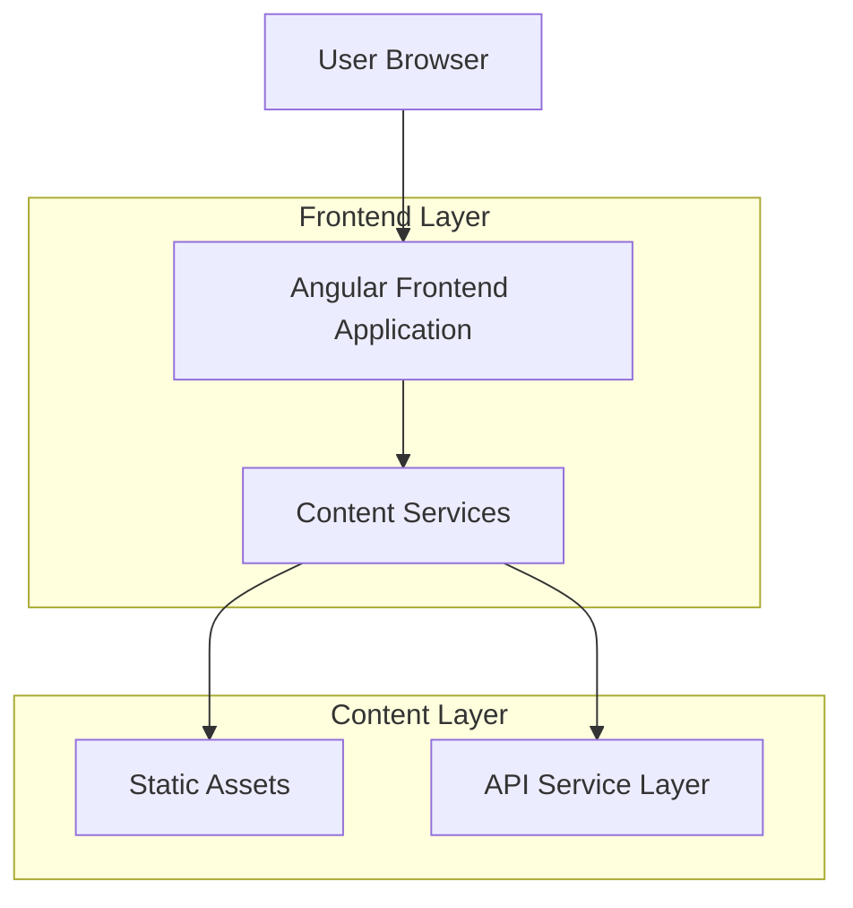

## 1. Architecture design



## 2. Technology Description

- **Frontend**: Angular@17 + TypeScript + Standalone Components
- **Styling**: TailwindCSS@3 with custom design system
- **Build Tool**: Angular CLI with Vite optimization
- **Icons**: Lucide Angular for consistent iconography
- **Animations**: Angular animations + CSS transitions
- **Backend**: None (static frontend consuming services)

## 3. Route definitions

| Route | Purpose |
|-------|---------|
| / | Home page with hero, services overview, testimonials |
| /services | Detailed services page with all permit types |
| /about | About page with school story and timeline |
| /contact | Contact page with form and location information |

## 4. Component Architecture

### 4.1 Core Components

**Layout Components**
```typescript
// Header Component (standalone)
@Component({
  selector: 'app-header',
  standalone: true,
  imports: [CommonModule, RouterModule]
})

// Footer Component (standalone)
@Component({
  selector: 'app-footer',
  standalone: true,
  imports: [CommonModule]
})
```

**UI Components**
```typescript
// Button Component (reusable)
@Component({
  selector: 'app-button',
  standalone: true,
  inputs: ['variant', 'size', 'disabled']
})

// Card Component (reusable)
@Component({
  selector: 'app-card',
  standalone: true,
  inputs: ['title', 'description', 'image']
})

// Service Card Component
@Component({
  selector: 'app-service-card',
  standalone: true,
  inputs: ['service']
})
```

### 4.2 Page Components

```typescript
// Home Page Component
@Component({
  selector: 'app-home',
  standalone: true,
  imports: [CommonModule, HeaderComponent, FooterComponent, ButtonComponent, CardComponent]
})

// Services Page Component
@Component({
  selector: 'app-services',
  standalone: true,
  imports: [CommonModule, ServiceCardComponent]
})

// About Page Component
@Component({
  selector: 'app-about',
  standalone: true,
  imports: [CommonModule, TimelineComponent]
})

// Contact Page Component
@Component({
  selector: 'app-contact',
  standalone: true,
  imports: [CommonModule, ContactFormComponent]
})
```

## 5. Service Architecture

### 5.1 Content Services

```typescript
// Content Service Interface
interface ContentService {
  getHeroContent(): Observable<HeroContent>
  getServices(): Observable<Service[]>
  getTestimonials(): Observable<Testimonial[]>
  getAboutContent(): Observable<AboutContent>
  getContactInfo(): Observable<ContactInfo>
}

// Mock Service Implementation
@Injectable({
  providedIn: 'root'
})
export class MockContentService implements ContentService {
  // Service methods returning observable data
}
```

### 5.2 Data Models

```typescript
// Core Interfaces
interface HeroContent {
  headline: string
  subheadline: string
  ctaPrimary: string
  ctaSecondary: string
  backgroundImage: string
}

interface Service {
  id: string
  title: string
  description: string
  category: 'permis-b' | 'permis-a' | 'code'
  icon: string
  features: string[]
}

interface Testimonial {
  id: string
  name: string
  rating: number
  comment: string
  image: string
}

interface ContactInfo {
  address: string
  phone: string
  email: string
  hours: string
}
```

## 6. Folder Structure

```
src/
├── app/
│   ├── components/
│   │   ├── ui/
│   │   │   ├── button/
│   │   │   ├── card/
│   │   │   └── icon/
│   │   ├── layout/
│   │   │   ├── header/
│   │   │   └── footer/
│   │   └── shared/
│   │       ├── service-card/
│   │       └── testimonial-card/
│   ├── pages/
│   │   ├── home/
│   │   ├── services/
│   │   ├── about/
│   │   └── contact/
│   ├── services/
│   │   └── content.service.ts
│   ├── models/
│   │   └── content.models.ts
│   └── app.routes.ts
├── assets/
│   ├── images/
│   ├── icons/
│   └── styles/
│       ├── tailwind.css
│       └── custom-components.css
```

## 7. Styling Architecture

### 7.1 Tailwind Configuration
```javascript
// tailwind.config.js
module.exports = {
  theme: {
    extend: {
      colors: {
        primary: {
          500: '#1e40af',
          600: '#1d4ed8'
        },
        accent: {
          500: '#f97316',
          600: '#ea580c'
        }
      },
      fontFamily: {
        sans: ['Inter', 'system-ui', 'sans-serif']
      }
    }
  }
}
```

### 7.2 Component Styling Strategy
- Use Tailwind utility classes for layout and spacing
- Create custom component classes for complex animations
- Maintain consistent design tokens across all components
- Implement responsive design with mobile-first approach